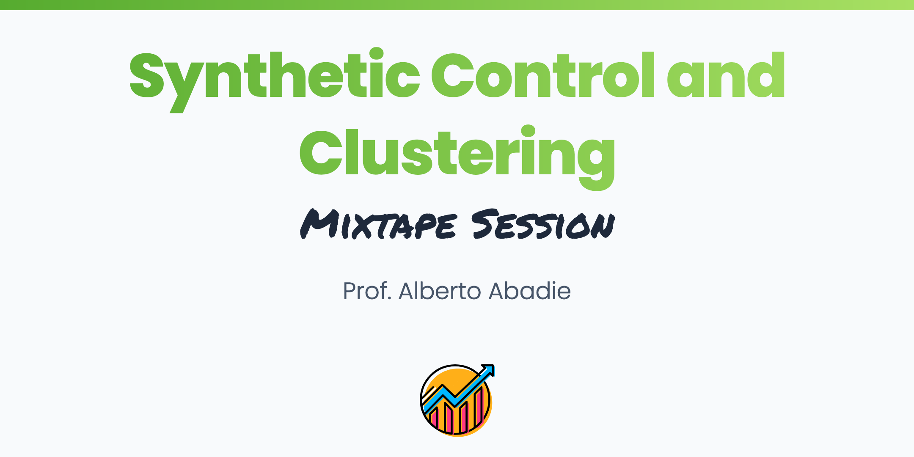

 
 

 

In this course, we will cover the fundamentals of synthetic control estimation and inference, with special emphasis on actionable guidance for applied research. We will discuss seven crucial guiding principles for empirical studies using synthetic controls and how these principles are applied in practice. Towards the end of the course, we will change topics to address “the” FAQ of econometrics office hours: When and how should we cluster standard errors?

 

 
 

<b>Synthetic Control</b>
 

<b>About</b>

<b>Slides</b>

<!-- [Introduction.pdf](Slides/01-introduction.pdf) -->

<b>Coding Exercise</b>

 

<b>Clustering</b>
 

<b>About</b>

<b>Slides</b>

<!-- [Staggered.pdf](Slides/02-staggered.pdf) -->

<b>Coding Exercise</b>

<!-- [Instructions](https://github.com/Mixtape-Sessions/Advanced-DID/blob/main/Exercises/Exercise-1/README.md#introduction) -->

 

